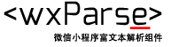
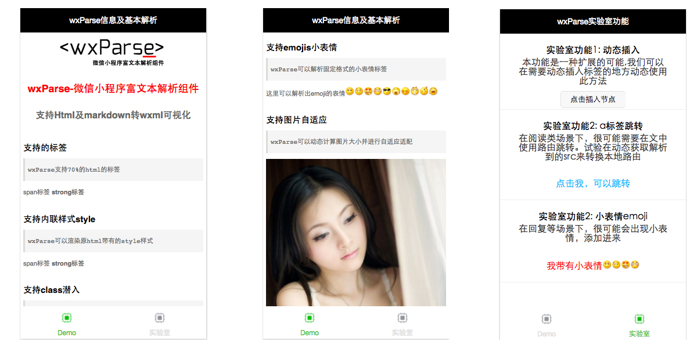

<p align="center"><a href="https://github.com/icindy/wxParse" target="_blank"></a></p>
<p align="center"><a href="https://github.com/icindy/wxParse" target="_blank"></a></p>
<h1 align="center" style="margin-bottom: 20px;">wxParse-微信小程序富文本解析组件</h1>
<h2 align="center">支持Html及markdown转wxml可视化</h2>
<p align="center"><code>版本号:0.3</code></p>
<p align="center">来源: [微信小程序开发论坛-weappdev](https://weappdev.com)</p>
<p align="center">作用: 将Html/Markdown转换为微信小程序的可视化方案</p>


## 特性


| 支持特性        | 实验功能           | ToDo  |
| ------------- |-------------| -----|
| - [x] HTML的大部分标签解析 | [x] 小表情emjio | [x] table标签 |
| - [x] 内联style          | [x] a标签跳转   |               |
| - [x] 标签Class          | [x] 动态添加    |               |
| - [x] 图片自适应规则       |               |                |
| - [x] 图片多图片预览      |                |               |
| - [x] 模版层级可扩展性    |                |               |
| - [x] 多数据循环方式      |                |  |
| - [x] 内联style         |                |   |
|         |                |   |

## 相关截图



## 感谢

[@stonewen](https://github.com/stonewen)| [@Daissmentii](https://github.com/Daissmentii)        | [@wuyanwen](https://github.com/wuyanwen)           | [@vcxiaohan](https://github.com/vcxiaohan)  |

## 基本使用方法

* 1. Copy文件夹`wxParse`
```
- wxParse/
  -wxParse.js(必须存在)
  -html2json.js(必须存在)
  -htmlparser.js(必须存在)
  -showdown.js(必须存在)
  -wxDiscode.js(必须存在)
  -wxParse.wxml(必须存在)
  -wxParse.wxss(必须存在)
  -emojis(可选)
```

* 2. 引入必要文件

```
//在使用的View中引入WxParse模块
var WxParse = require('../../wxParse/wxParse.js');
```

```
//在使用的Wxss中引入WxParse.css,可以在app.wxss
@import "/wxParse/wxParse.wxss";
```

* 3. 数据绑定
```
var article = '<div>我是HTML代码</div>';
/**
* WxParse.wxParse(bindName , type, data, target,imagePadding)
* 1.bindName绑定的数据名(必填)
* 2.type可以为html或者md(必填)
* 3.data为传入的具体数据(必填)
* 4.target为Page对象,一般为this(必填)
* 5.imagePadding为当图片自适应是左右的单一padding(默认为0,可选)
*/
var that = this;
WxParse.wxParse('article', 'html', article, that, 5);
```

* 4. 模版引用
```
// 引入模板
<import src="你的路径/wxParse/wxParse.wxml"/>
//这里data中article为bindName
<template is="wxParse" data="{{wxParseData:article.nodes}}"/>
```

## 高级用法

* 配置小表情emojis
```
/**
* WxParse.emojisInit(reg,baseSrc,emojis)
* 1.reg，如格式为[00]=>赋值 reg='[]'
* 2.baseSrc,为存储emojis的图片文件夹
* 3.emojis,定义表情键值对
*/
WxParse.emojisInit('[]', "/wxParse/emojis/", {
      "00": "00.gif",
      "01": "01.gif",
      "02": "02.gif",
      "03": "03.gif",
      "04": "04.gif",
      "05": "05.gif",
      "06": "06.gif",
      "07": "07.gif",
      "08": "08.gif",
      "09": "09.gif",
      "09": "09.gif",
      "10": "10.gif",
      "11": "11.gif",
      "12": "12.gif",
      "13": "13.gif",
      "14": "14.gif",
      "15": "15.gif",
      "16": "16.gif",
      "17": "17.gif",
      "18": "18.gif",
      "19": "19.gif",
    });
```

* 多数据格式
 + 参见wiki[wxParse多数据循环使用方法](https://github.com/icindy/wxParse/wiki/wxParse%E5%A4%9A%E6%95%B0%E6%8D%AE%E5%BE%AA%E7%8E%AF%E4%BD%BF%E7%94%A8%E6%96%B9%E6%B3%95)

## FAQ

* 参见wiki[weParse常见问题FAQ](https://github.com/icindy/wxParse/wiki/wxParse%E5%B8%B8%E8%A7%81%E9%97%AE%E9%A2%98FAQ)

## 二次开发

* 基础数据格式

```
parsedata:{
    view:{},//样式存储
    nodes:{},//展示需要的存储节点
    images:[],//存放图片对象数组
    imageUrls:[],//存放图片url数组
}

```

* 参见wiki[wxParse二次开发文档](https://github.com/icindy/wxParse/wiki/wxParse%E4%BA%8C%E6%AC%A1%E5%BC%80%E5%8F%91%E6%96%87%E6%A1%A3)

## 相关文章

* [wxDiscode－微信小程序特殊字符转义符转化工具类](http://weappdev.com/t/wxdiscode/203)
* [微信小程序组件wxParse中的模版template使用 既然不能循环那就使用笨办法](http://weappdev.com/t/wxparse-template/192)
* [微信小程序单图片的自适应计算](https://weappdev.com/t/topic/301)


## 捐献

* 参见wiki[捐献作者](https://github.com/icindy/wxParse/wiki/%E6%8D%90%E7%8C%AE%E4%BD%9C%E8%80%85)

## 来源
[微信小程序开发论坛](http://weappdev.com)
垂直微信小程序开发交流社区

可在网站扫描二维码进入我们的微信小程序群，也可以微信搜索"weappmsg"进入"小码消息"公众号

其他方式:合作qq群511389428


