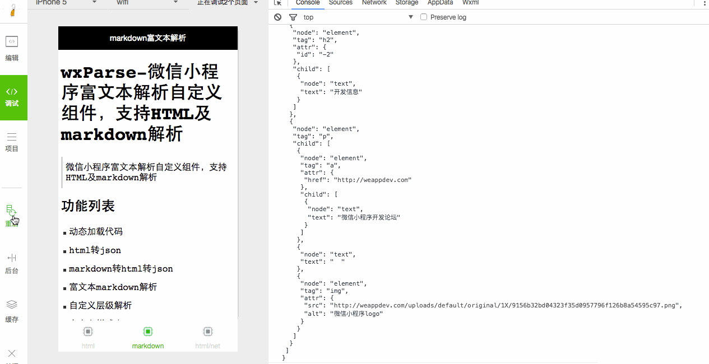

# wxParse-微信小程序富文本解析自定义组件，支持HTML及markdown解析

> 本项目由[微信小程序开发论坛-WeAppDev](http://weappdev.com/) [http://weappdev.com/](http://weappdev.com/) 会员开发

> 垂直微信小程序开发交流社区

# 效果GIF(加载较慢，请稍候)



## 代码库

> github地址: [https://github.com/icindy/wxParse](https://github.com/icindy/wxParse)

## 现状

`版本号: Alpha0.1`-目前还不太适合直接使用

> 目前项目不属于完整版，只是大概完成了基础的构思项目，能够解析基本的html，基础的markdown。
**希望大家能够发现问题，提交问题，也可以foke提交您的修改代码**

* 项目目前在只是测试版，需要进一步完善
* 需要完善样式wxParse,wxss
* 需要加强markdown解析html
* 其他

## 组成

```
-wxParse
--wxParse.js(工具类入口输出口)
--wxParse.wxml(模版文件)
--wxParse.wxss(定义css)

```

## 使用方法

* 复制整个文件夹`wxParse/`到根目录
* 把样式文件`wxParse.wxss`引入到您调用本插件的作用域喜爱
```
@import "你的路径/wxParse/wxParse.wxss";
```

* 在需要使用的模版的`x.wxml`中引入模版文件`wxParse.wxml`
```
<import src="你的路径/wxParse/wxParse.wxml"/>
<view class="wxParse">
<template is="wxParse" data="{{wxParseData}}"/>
</view>
```
* 在对应的js中引入`wxParse.js`文件
```
var WxParse = require('你的路径/wxParse/wxParse.js');
```
* 设置对应data值数组`wxParseData`(必须使用wxParseData),并设置


```

// html解析

onLoad: function () {
    console.log('onLoad')
    var html = '<div class="content mousetrap"><h1 id="wxparse">wxParse-微信小程序富文本解析自定义组件，支持HTML及markdown解析</h1> <blockquote><p>微信小程序富文本解析自定义组件，支持HTML及markdown解析</p></blockquote> <h2 id="-">功能列表</h2> <ul> <li>动态加载代码</li> <li>html转json</li> <li>markdown转html转json</li> <li>富文本markdown解析</li> <li>自定义层级解析</li> <li>自定义样式表</li> </ul> <h2 id="-">文件作用</h2> <pre class="hljs scala"><code class="scala"><span class="hljs-comment">// wxParse.wxml</span> <span class="hljs-comment">//用于解析使用的模版</span> .css{ text-align:center; } &lt;div&gt;test div&lt;/div&gt;</code></pre> <h2 id="-">开发信息</h2> <p><a href="http://weappdev.com" target="_blank">微信小程序开发论坛</a></p> <div class="image-package"><br><div class="image-caption">微信小程序logo</div></div> </div>';

    var that = this
    //更新数据
    that.setData({
      wxParseData:WxParse('html',html)
    })
  }

```

```

// markdown解析

onLoad: function () {
    console.log('onLoad')
    var text = '# wxParse-微信小程序富文本解析自定义组件，支持HTML及markdown解析 \n'
    +' > 微信小程序富文本解析自定义组件，支持HTML及markdown解析 \n\n' 
    +'## 功能列表 \n * 动态加载代码  \n * html转json \n * markdown转html转json \n * 富文本markdown解析 \n * 自定义层级解析 \n * 自定义样式表 \n'
    +'## 文件作用 \n'
    +' ``` // wxParse.wxml //用于解析使用的模版 ``` \n'
    +'## 开发信息 \n '
    +' [微信小程序开发论坛](http://weappdev.com) \n'
    +' ';

    var that = this
    //更新数据
    that.setData({
      wxParseData:WxParse('md',text)
    })
  }

```


## 功能列表

* 动态加载代码
* html转json
* markdown转html转json
* 富文本markdown解析
* 自定义层级解析
* 自定义样式表

## TODO

* 添加更多标签的解析
* 去重与定制样式
* 解决组件中的问题

## 第三方引用

* [html->json html2json](https://github.com/Jxck/html2json)
目前没有找到更好的，感觉解析还是有问题，欢迎提供更好的代替品

* [markdown->html showdown](https://github.com/showdownjs/showdown)

##  开发信息

[微信小程序开发论坛](http://weappdev.com)
垂直微信小程序开发交流社区


## Time

 * 2016.10.24 Alpha0.1 发布