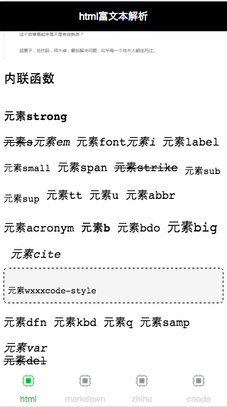
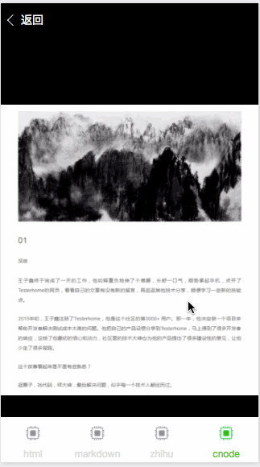
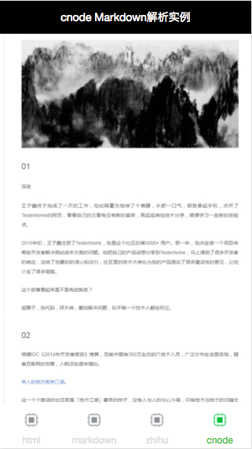
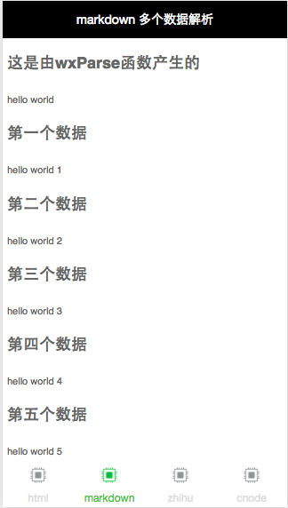
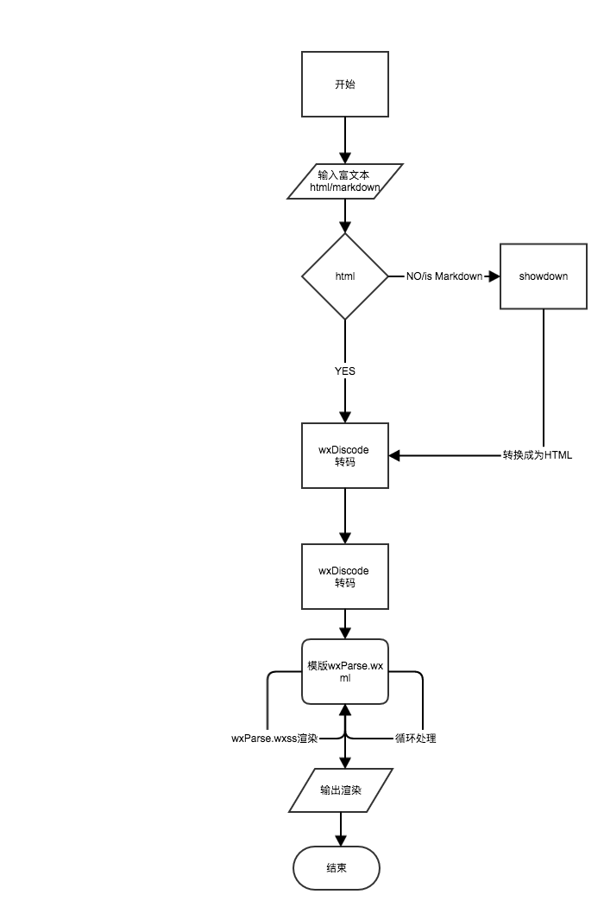
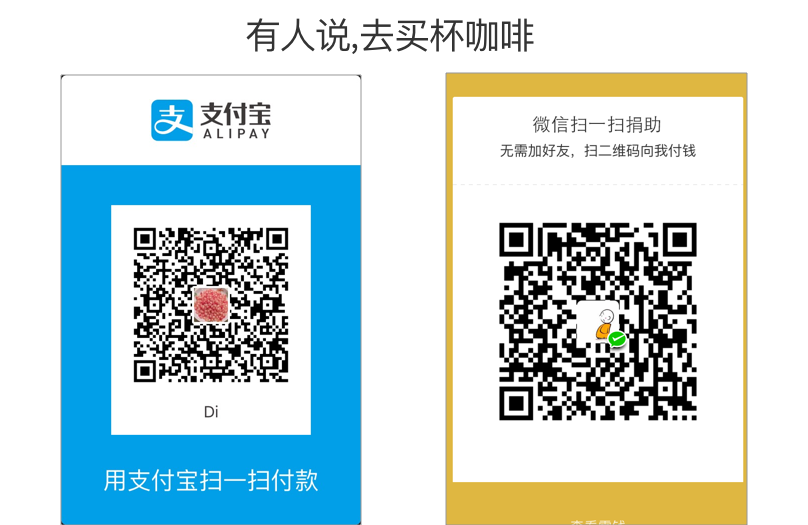

## 特别提示，紧急添加

> 由于wx.geiImageInfo无法在真机获取网络图片大小，紧急修改方案，在使用的用户无比关注这个地方

* 5.必须加入wxParseImgLoad,为图片加载后调整大小
```
 wxParseImgLoad: function (e){
    var that = this
    WxParse.wxParseImgLoad(e,that)
  }
```

## wxParse信息

* 版本号`0.1`
* 历史版本号`0.2` 具体代码请查看仓库分支`V1`
* github地址: [https://github.com/icindy/wxParse](https://github.com/icindy/wxParse)
* 解决问题:微信小程序富文本html、md解析组件
* 详述:因为微信小程序没有提供webview等html解析，原展示类文本没有办法图文并茂的原生展示，wxParse主要目的就是弥补富文本解析空缺的组件，欢迎使用反馈

##  开发信息

[微信小程序开发论坛](http://weappdev.com)
垂直微信小程序开发交流社区


## 贡献者

 * me
 * [@Daissmentii](https://github.com/Daissmentii)
 * [@wuyanwen](https://github.com/wuyanwen)

## 本次更新主要内容

* 特性增加
 + 增加内联样式
 + 增加Class植入
 + 增加图片视觉适应
 + 增加图片预览及相册功能
 + 增加标签分类(行内和块级标签分类)

* 使用优化
 + 减少引入使用代码
 + 优化使用方式
 + 释放更多接口
 
## 各个功能预览

* 多标签解析



* 图片预览和相册功能GIF



* 图片视觉自适应



* 多个数据渲染



## 使用方式

> `wxParse 0.2`相比`wxParse 0.1` 优化了使用方式减少使用代码

* 1.复制插件文件`wxParse`文件夹

* 2.引入模版代码
```
<import src="../../wxParse/wxParse.wxml"/> 
<template is="wxParse" data="{{wxParseData}}"/>
```
* 3.引入模版样式
```
在app.wxss或者使用wxss内
@import "/wxParse/wxParse.wxss";
```
* 4.引入执行文件
```
var WxParse = require('../../wxParse/wxParse.js')
/*** 传值* 1. 类型type->'md/html'* 2. 介些内容data* 3. 指向对象-> page*/
var that = this
WxParse.wxParse('html',html,that)
```

* 5.必须加入wxParseImgLoad,为图片加载后调整大小
```
 wxParseImgLoad: function (e){
    var that = this
    WxParse.wxParseImgLoad(e,that)
  }
```

* 6.可选: image的tap事件,影响图片预览和相册功能
```
wxParseImgTap: function(e){
    var that = this
    WxParse.wxParseImgTap(e,that)
  }
```

## 高级用法(多数据使用)

> 在实际生产环境下，你可能需要一个页面解析多个HTML或者md的，version 0.2更新支持一个页面多数据支持

**感谢[@Daissmentii](https://github.com/Daissmentii)对本模块的帮助和修改**

使用`wxMoreParse(bindData,type,data,target)`

**bindData->指之前后需要绑定数据指向**


* 1.模版处理


```
<import src="../../wxParse/wxParse.wxml"/>
<template is="wxParse" data="{{wxParseData:moreData1.tagArray}}"/>
<template is="wxParse" data="{{wxParseData:moreData2.tagArray}}"/>
<template is="wxParse" data="{{wxParseData:moreData3.tagArray}}"/>
<template is="wxParse" data="{{wxParseData:moreData4.tagArray}}"/>
<template is="wxParse" data="{{wxParseData:moreData5.tagArray}}"/>
<template is="wxParse" data="{{wxParseData:moreData6.tagArray}}"/>
<template is="wxParse" data="{{wxParseData:moreData7.tagArray}}"/>
```

＊ 2.数据处理


```
onLoad: function () {
    console.log('onLoad')
    var text = '<h1>这是由wxParse函数产生的</h1><p>hello world</p>';
    var text1 = '<h1>第一个数据</h1><p>hello world 1</p>';
    var text2 = '<h1>第二个数据</h1><p>hello world 2</p>';
    var text3 = '<h1>第三个数据</h1><p>hello world 3</p>';
    var text4 = '<h1>第四个数据</h1><p>hello world 4</p>';
    var text5 = '<h1>第五个数据</h1><p>hello world 5</p>';
    var text6 = '<h1>第六个数据</h1><p>hello world 6</p>';
    var that = this
    WxParse.wxParse('html',text,that);
    WxParse.wxMoreParse('moreData1','html',text1,that)
    WxParse.wxMoreParse('moreData2','html',text2,that)
    WxParse.wxMoreParse('moreData3','html',text3,that)
    WxParse.wxMoreParse('moreData4','html',text4,that)
    WxParse.wxMoreParse('moreData5','html',text5,that)
    WxParse.wxMoreParse('moreData6','html',text6,that)
 }
```

## 相关讲解文章

* [wxDiscode－微信小程序特殊字符转义符转化工具类](http://weappdev.com/t/wxdiscode/203)
* [微信小程序组件wxParse中的模版template使用 既然不能循环那就使用笨办法](http://weappdev.com/t/wxparse-template/192)
* [微信小程序单图片的自适应计算](https://weappdev.com/t/topic/301)

## 第三方引用

* [html->json html2json](https://github.com/Jxck/html2json)
目前没有找到更好的，感觉解析还是有问题，欢迎提供更好的代替品

* [markdown->html showdown](https://github.com/showdownjs/showdown)

## 流程图



##  开发信息

[微信小程序开发论坛](http://weappdev.com)
垂直微信小程序开发交流社区

## 合作方

 * 欢迎加入微信小程序开发QQ群 511389428

## 历史版本信息

* 历史版本`version 0.1`
* 相关文章
  + [[wxParse version0.1正式发布-全面支持微信小程序富文本html及markdown动态解析](https://weappdev.com/t/wxparse-version0-1-html-markdown/208)](https://weappdev.com/t/wxparse-version0-1-html-markdown/208)

## 捐助信息


